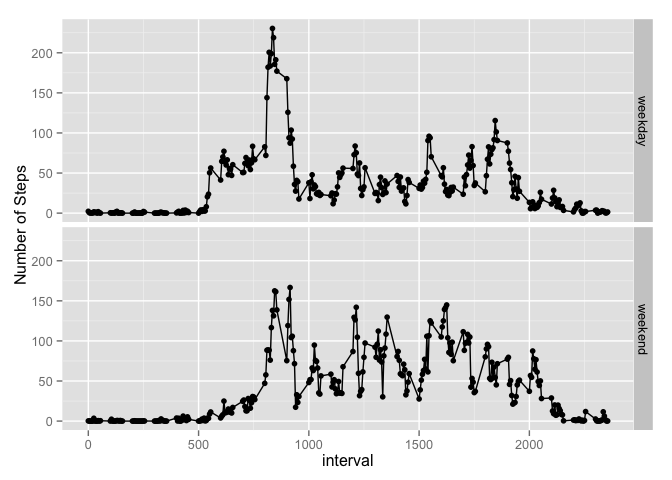

# Reproducible Research: Peer Assessment 1

## Loading and preprocessing the data

First, we will set the working directory, load the necessary packages, 
and place the data into a variable.


```r
setwd("~/R Working Directory/RepResearchProjOne/RepData_PeerAssessment1/")

library(ggplot2)
library(dplyr)

dat <- read.csv("activity.csv")
dat$date <- as.Date(dat$date,format = "%Y-%m-%d")
```

## What is mean total number of steps taken per day?

With this code, we will form a histogram of the number of steps per day. After
looking at the distribution, we will calculate the mean and median


```r
by_day <- aggregate(steps~date,dat,sum,na.rm=T)
hist(by_day$steps)
```

 

```r
mean(by_day$steps)
```

```
## [1] 10766
```

```r
median(by_day$steps)
```

```
## [1] 10765
```

## What is the average daily activity pattern?

Here we use the dplyr package to group and summarize the data into a new
data frame.  Then we will plot the two variables in the data frame with the
base plotting package.  After this we will use which.max to find the index
of the maximum mean steps.


```r
avg<- dat %>%
    group_by(interval) %>%
    summarise(new = mean(steps, na.rm =T))
plot(avg$interval, avg$new,data = avg,type="l")
```

 

```r
avg[which.max(avg$new),]
```

```
## Source: local data frame [1 x 2]
## 
##   interval   new
## 1      835 206.2
```

## Inputting missing values

There are missing data in our files.  Let's count the number of occurences:


```r
with(dat, table(is.na(steps)))
```

```
## 
## FALSE  TRUE 
## 15264  2304
```

As the table shows, there are 2304 occurences where the 'steps' variable
is NA.  Let's replace those values with the mean of what normally happens in that
time period:


```r
newDat <- dat %>%
    left_join(avg) 
```

```
## Joining by: "interval"
```

```r
newDat$Step <- ifelse(is.na(newDat$steps), newDat$new, newDat$steps)

by_day <- aggregate(Step~date,newDat,sum,na.rm=T)
hist(by_day$Step)
```

 

```r
mean(by_day$Step)
```

```
## [1] 10766
```

```r
median(by_day$Step)
```

```
## [1] 10766
```

The mean for this data stays the same, however the median is now equal to the
mean.  We can take this to mean that the variance of the data is lower

## Are there differences in activity patterns between weekdays and weekends?

Here we will attach a 'weekday' or 'weekend' attribute to each occurence.


```r
newDat$Day <- weekdays(newDat$date)
newDat$Day <- ifelse(newDat$Day == "Saturday" | newDat$Day=='Sunday', 'weekend','weekday')
newDat$Day <- as.factor(newDat$Day)

avg<- newDat %>%
    group_by(Day, interval) %>%
    summarise(new = mean(Step, na.rm =T))

qplot(interval, new, data = avg, facets = Day~.) +
    geom_line() + ylab("Number of Steps")
```

 


